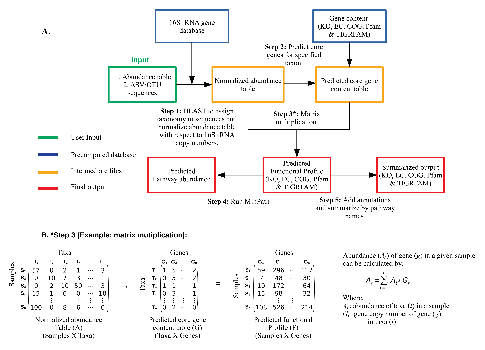

 

<h2>MicFunPred: A conserved approach to predict functional profiles from 16S rRNA gene sequence data</h2>

<h4><b>Webserver:</b> <a href='http://micfunpred.microdm.net.in/'>http://micfunpred.microdm.net.in/</a>
 
<b>GitHub repo:</b> <a href='https://github.com/microDM/MicFunPred'>https://github.com/microDM/MicFunPred</a>
</h4>

 

<b>‘MicFunPred’</b> uses a set of core genes predicted at the genus level to derive imputed metagenomes with minimal false positive predictions. MicFunPred predicts a set of core genes using ~32,000 reference IMG permanent/finished draft genomes. On simulated datasets, MicFunPred showed the lowest False Positive Rate (FPR) with mean <b>Spearman’s correlation of 0.89 (SD=0.03)</b> while on 7 different real datasets the mean correlation was 0.75 (SD=0.08). <b>MicFunPred was found to be faster with low computational requirements and performed better or comparable when compared with other tools</b>.

 
<h2> Methodology</h2>

<h3> Reference database</h3>
MicFunPred relies on 32,453 genomes (permanent drafts/finished) downloaded from the <a href='https://img.jgi.doe.gov/'>Integrated Microbial Genome (IMG)</a> database. Gene content tables were constructed in terms of <a href='https://www.genome.jp/kegg/'>Kegg Orthology (KO)</a>, <a href='https://www.ncbi.nlm.nih.gov/research/cog-project/'>Cluster Of Genes (COG)</a>, <a href='https://www.ncbi.nlm.nih.gov/genome/annotation_prok/tigrfams/'>TIGRFAM</a>, <a href='https://www.ebi.ac.uk/intenz/rules.jsp'>Enzyme Commission (EC)</a>, <a href='http://www.cazy.org/'>CAZymes</a> and <a href='http://pfam.xfam.org/'>Protein Family (Pfam)</a>. A consolidated 16S rRNA gene database was developed using extracted sequences from genomes along with sequences from <a href='https://greengenes.secondgenome.com/'>Greengenes (v13_5)</a>, <a href='https://www.arb-silva.de/'>SILVA (v132)</a>, and <a href='https://help.ezbiocloud.net/ezbiocloud-16s-database/'>EZBiocloud (v2018.05)</a> database. Sequences with length < 1200 and unannotated genera level taxonomy were filtered out and remaining sequences were clustered at 97% using <a href='https://www.bioinformatics.org/cd-hit/'>Cd-hit</a> to prepare the final database with 51,362 sequences.

 

<h3> Implementation</h3>
MicFunPred predicts functional profiles from 16S rRNA gene amplicon sequence data by using a more conserved approach involving core genes of each genus, thereby minimizing the false-positive results. An abundance table and 16S rRNA gene sequences from OTU/ASV based approach can be used directly. First, OTU/ASV sequences are searched against a custom 16S rRNA gene database using <a href='https://blast.ncbi.nlm.nih.gov/Blast.cgi'>BLAST</a>. The taxonomy is assigned to each OTU/ASV at the genus level (if percent identity >= user cutoff) and the abundance table is then consolidated at assigned taxonomy level. The consolidated abundance table then normalized with mean 16S rRNA gene copy numbers for each taxon. The gene content (only core genes) for each genus listed in the abundance table is predicted. Core genes are defined as a set of all genes present in x% of genomes from each genus (the value of ‘x’ can be adjusted by the ‘Gene coverage’ cut-off). Using normalized abundance and predicted gene content table, metagenomes in terms of KO, EC, TIGRFAM, COG, CAZymes & Pfam are calculated by performing a dot product of two matrices. For pathway prediction, naive approaches can give inflated estimates of biological pathways. Hence, we have used <a href='https://omics.informatics.indiana.edu/MinPath/'>MinPath</a>, which gives estimates of a minimal set of pathways using a more conservative parsimony approach.
 

 

  

[^1]: This website is created using [Shiny](https://shiny.rstudio.com/)

    All rights reserved by National Centre for Cell Science, Pune, India.