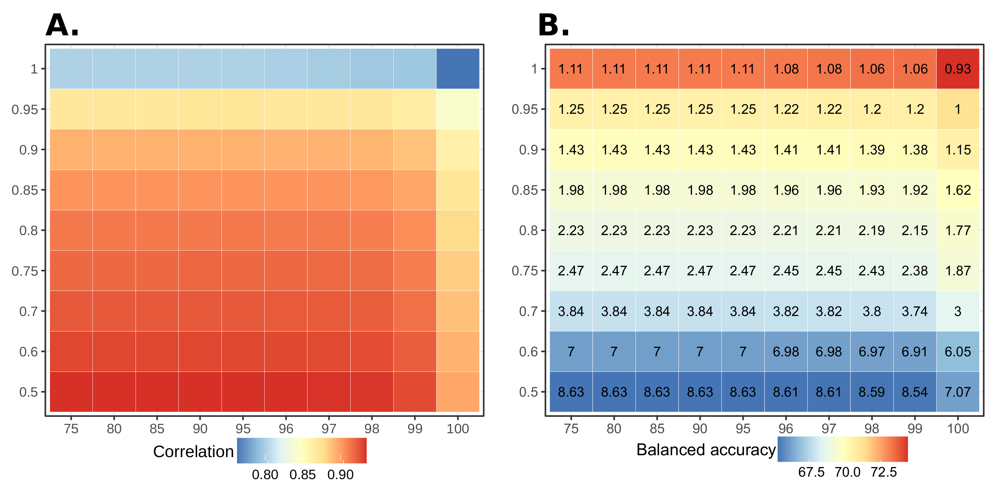

<style>
.text{
    padding-right:100px;
    padding-left:100px;
    text-align: justify;
    text-justify: inter-word;
    font-family: 'Lato';
    font-size: 16px
}
</style>

<div class='text' markdown='1'>
<h1> Help Manual</h1>

<h2>Running Prediction</h2>

MicFunPred accepts abundance table in the tab-separated (samples in columns and ASV/OTU ids in rows) format while OTU/ASV sequences in FASTA format.
<br>
Percent identity and gene coverage cut-off are the two main parameters that affect the performance of MicFunPred. Performance of MicFunPred on the simulated human dataset at different % identity (x-axis) and gene coverage cut-offs (y-axis) is shown in terms of Spearman’s correlation (A), balanced accuracy of gene presence/absence prediction and False Positive rate (FPR) (B). It was observed that at stringent cut-offs correlation and FPr drops while the balanced accuracy increases.
<br>
<p align='center'></p>
<br>
</div>
<h3>Output files</h3>

The output directory will have following files:
```
├── COG_metagenome
│   ├── COG_metagenome.tsv.gz
│   ├── COG_metagenome_with_description.tsv.gz
│   └── COG_taxon_contrib.tsv.gz
├── KO_metagenome
│   ├── KO_level_taxon_contrib.html
│   ├── KO_level_taxon_contrib.tsv.gz
│   ├── KO_metagenome.tsv.gz
│   ├── KO_metagenome_minPath_pruned.txt
│   ├── KO_metagenome_with_description.tsv.gz
│   ├── KO_taxon_contrib.tsv.gz
│   ├── minpath.out
│   ├── minpath_in.ko
│   ├── summarized_by_A.tsv.gz
│   ├── summarized_by_B.tsv.gz
│   ├── summarized_by_C.tsv.gz
│   └── summarized_by_Pathway_Module.tsv.gz
├── MetaCyc_metagenome
│   ├── EC_metagenome.tsv.gz
│   ├── EC_taxon_contrib.tsv.gz
│   ├── PathwayAbundance.tsv.gz
│   ├── PathwayAbundance_with_names.tsv.gz
│   ├── Pathway_summarize_by_Types.tsv.gz
│   ├── RXN_metagenome.tsv.gz
│   └── minPath_files
│       ├── sample1_minpath.out
│       ├── sample1_minpath.out.details
│       ├── sample1_minpath_in.txt
│       ├── sample2_minpath.out
│       ├── sample2_minpath.out.details
│       ├── sample2_minpath_in.txt
│       ├── sample3_minpath.out
│       ├── sample3_minpath.out.details
│       ├── sample3_minpath_in.txt
│       ├── sample4_minpath.out
│       ├── sample4_minpath.out.details
│       ├── sample4_minpath_in.txt
│       ├── sample5_minpath.out
│       ├── sample5_minpath.out.details
│       └── sample5_minpath_in.txt
├── Pfam_metagenome
│   ├── Pfam_metagenome.tsv.gz
│   ├── Pfam_metagenome_with_description.tsv.gz
│   └── Pfam_taxon_contrib.tsv.gz
├── TIGRFAM_metagenome
│   ├── TIGRFAM_metagenome.tsv.gz
│   ├── TIGRFAM_metagenome_with_description.tsv.gz
│   └── TIGRFAM_taxon_contrib.tsv.gz
├── Cazy_metagenome
    ├── Cazy_metagenome.tsv.gz
    ├── Cazy_metagenome_with_description.tsv.gz
    ├── Cazy_metagenome_contrib.tsv.gz
├── out.blast
├── predicted_16S_copy_numbers.txt
├── predicted_COG.tsv.gz
├── predicted_EC.tsv.gz
├── predicted_KO.tsv.gz
├── predicted_Pfam.tsv.gz
├── predicted_TIGRFAM.tsv.gz
├── tax_abund.table
└── tax_abund_normalized.table
```

[^1]: This website is created using [Shiny](https://shiny.rstudio.com/)

    All rights reserved by National Centre for Cell Science, Pune, India.
