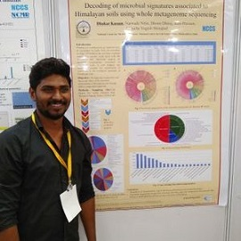
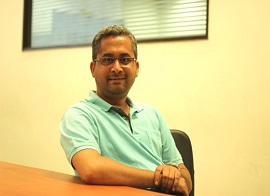
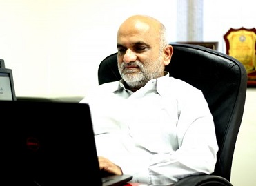

<html>
  <head>
    <title></title>
    
  </head>
  <body>
  

    <table class='table'>
      <th colspan=3>
<b><h3>Developers
</b>
</th>
      <tr></tr>
      <tr>
        <td style="width:400px">
            

            
            <h4 class="card-title">Dattatray S. Mongad</h4>
            
Ph.D. Student @National centre for Cell Science, Pune, India.

             &nbsp;&nbsp;
             &nbsp;&nbsp;
             &nbsp;&nbsp;
             &nbsp;&nbsp;
            
            

        </td>
        <td style="width:400px">
            

            
            <h4 class="card-title">Nikeeta S. Chavan</h4>
            
Lead Software Engineer, Persistent Systems Limited, Pune, India.

             &nbsp;&nbsp;
             &nbsp;&nbsp;
            &nbsp;&nbsp;
             &nbsp;&nbsp;
            

        </td>
        <td style="width:400px">
            

            
            <h4 class="card-title">Nitin P. Narwade</h4>
            
Marie Curie Fellow, Universidad Miguel Hernández de Elche, Spain

             &nbsp;&nbsp;
             &nbsp;&nbsp;
            &nbsp;&nbsp;
             &nbsp;&nbsp;
            
            

        </td>
      </tr>
    </table>
    <table>
    <td style="width:250px"></td>
    <th colspan=2>
<b><h3>Invigilators
</b>
</th>
    <tr></tr>
    <tr>
    <td style="width:250px"></td>
      <td style="width:400px">
            

            
            <h4 class="card-title">Dr. Dhiraj P. Dhotre</h4>
            
Scientist 'D', National Centre for Cell Science, Pune, India.

             &nbsp;&nbsp;
            &nbsp;&nbsp;
             &nbsp;&nbsp;
            
            

        </td>
        <td style="width:400px">
            

            
            <h4 class="card-title">Dr. Yogesh S. Shouche</h4>
            
Emeritus Scientist, National Centre for Cell Science, Pune, India.

             &nbsp;&nbsp;
            &nbsp;&nbsp;
             &nbsp;&nbsp;
            
            

        </td>
    </tr>
    </table>
    

  </body>
</html>

